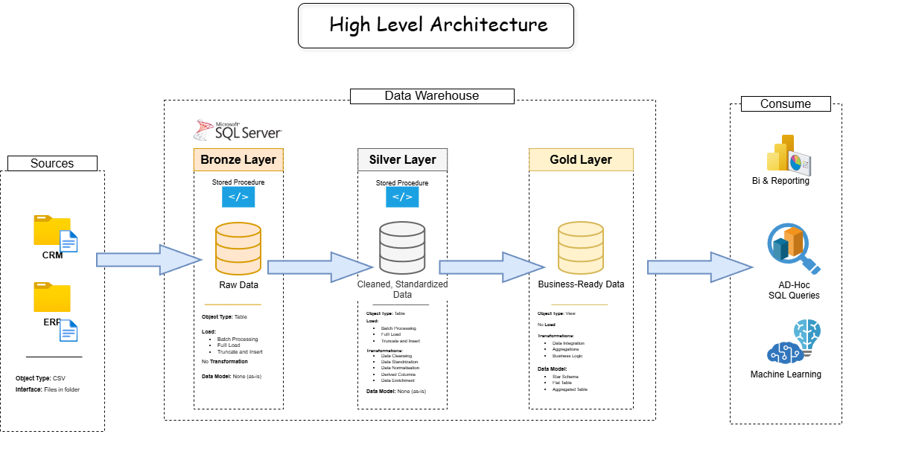

# Data Warehouse and Analytics Project

Welcome to the **Data Warehouse and Analytics Project** 🚀  
This repository showcases an end-to-end **data warehousing and analytics solution** built using **SQL Server**, following modern data engineering best practices. The project is based on data architecture, ETL, data modeling, and analytics.

---

## 🏗️ Data Architecture

The data architecture for this project follows Medallion Architecture **Bronze**, **Silver**, and **Gold** layers:


### 🥉 Bronze Layer
- Stores raw data exactly as received from source systems
- Data is ingested from CSV files into SQL Server
- No transformations applied

### 🥈 Silver Layer
- Performs data cleansing, standardization, and normalization
- Handles null values, duplicates, and data type issues
- Prepares data for analytics

### 🥇 Gold Layer
- Contains business-ready data
- Modeled using a star schema (fact and dimension tables)
- Optimized for analytical queries and reporting

---

## 📖 Project Overview

This project covers the complete lifecycle of a modern data warehouse:

1. **Data Architecture**  
   Design of a SQL Server data warehouse using Bronze, Silver, and Gold layers.

2. **ETL Pipelines**  
   Extracting data from source systems, transforming it step by step, and loading it into the warehouse.

3. **Data Modeling**  
   Creating fact and dimension tables using surrogate keys and analytical modeling techniques.

4. **Analytics & Reporting**  
   Writing SQL queries to analyze:
   - Customer behavior
   - Product performance
   - Sales trends

---

## 🛠️ Tools & Technologies

- SQL Server Express  
- SQL Server Management Studio (SSMS)  
- Git & GitHub  
- Draw.io  
- Notion  

---

## 🚀 Project Requirements

### Data Engineering – Building the Data Warehouse

#### Objective
Build a modern SQL Server data warehouse to consolidate sales data from multiple sources for analytical reporting.

#### Specifications
- **Data Sources**: ERP and CRM systems provided as CSV files
- **Data Quality**: Data cleansing and validation before analysis
- **Integration**: Unified analytical data model
- **Scope**: Latest snapshot only (no historization)
- **Documentation**: Clear data model and transformation documentation

---

### Analytics & Reporting

#### Objective
Develop SQL-based analytics to generate insights into:
- Customer behavior
- Product performance
- Sales trends

These insights support data-driven decision-making.

---

## 📂 Repository Structure

```
data-warehouse-project/
│
├── datasets/                    # Source CSV files
│
├── docs/                        # Architecture & documentation
│   ├── etl.png
│   ├── data_architecture.png
│   ├── data_flow.png
│   ├── data_models.png
│   ├── data_catalog.md
│   ├── naming-conventions.md
│
├── scripts/                     # SQL scripts
│   ├── bronze/                  # Raw ingestion
│   ├── silver/                  # Cleansing & transformation
│   ├── gold/                    # Analytical models
│
├── tests/                       # Data quality checks
│
├── README.md
├── LICENSE
|
```

---

## 🛡️ License

This project is licensed under the **MIT License**.

---

## 👤 About Me

Hi, I’m **Sujoy** 👋  
A data professional focused on **SQL Server, data warehousing, ETL pipelines, and analytics**.  
This project demonstrates practical implementation of real-world data engineering concepts.
